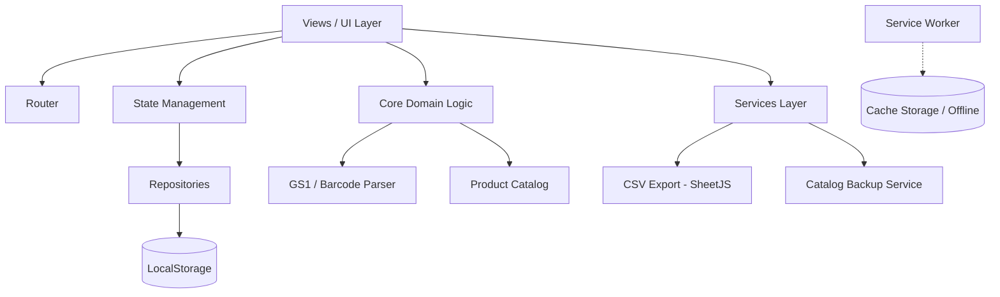

# Goods In - Inbound Register (PWA)

An offline-first Progressive Web Application (PWA) designed to streamline, standardise, and accelerate the goods receiving (*Goods In / Inbound*) process in warehouse and logistics operations.

---

## 🎯 Operational Context & Purpose

In fast-paced warehouse and distribution centre environments (such as DHL supply chain hubs in Ireland and the UK), inbound freight receiving demands high throughput, data accuracy, and resilience against intermittent Wi-Fi dead zones.

The **Goods In - Inbound Register** addresses these floor challenges by providing a fast, distraction-free, tactile interface optimised for mobile barcode terminals (Zebra, Honeywell) and mobile devices.

### Key Capabilities:
1. **Inbound Session Management**: Open an inbound manifest with arrival date and inbound reference number.
2. **GS1 Barcode Scanning**: Scan pallet and case barcodes (GS1-128 / EAN) to automatically decode GTIN, Batch Code, and Best Before Date (BBD).
3. **Automated Pallet Layer Calculation**: Convert complete pallet layers (*Ti/Hi*) and partial loose cases directly into total quantities.
4. **Local Master Product Catalogue**: Instant SKU lookup from local cache with on-the-fly registration for newly discovered products.
5. **WMS-Ready CSV Export**: Generate structured CSV files formatted for direct ingestion into legacy WMS/ERP systems.
6. **Archival & Inbound History**: Manage completed receipts and access historic inbound records.
7. **Catalogue Backup & Restore**: Export and import the product master database via structured JSON files.

---

## 🏗️ Architecture Overview

Built with **Vanilla Modern JavaScript (ES Modules)** without heavy framework overhead. This ensures zero build steps, instant load times, minimal memory footprint, and complete control over the application lifecycle.



### Directory Structure

```text
app/
├── css/
│   └── style.css                     # High-contrast, tactile UI styles for warehouse terminals
├── icons/                            # PWA application icons (192x192, 512x512)
├── js/
│   ├── app.js                        # App bootstrap, lifecycle restoration & SW registration
│   ├── router.js                     # State-driven SPA view router
│   ├── components/
│   │   └── autocomplete.js           # Reusable autocomplete input helper
│   ├── core/                         # Pure domain logic (isolated from DOM/UI)
│   │   ├── barcode/                  # Barcode identification & parsing engine
│   │   │   ├── barcodeTypes.js       # Barcode specification enums (GS1, etc.)
│   │   │   ├── detectBarcodeFormat.js# Format detection rules
│   │   │   ├── parserFactory.js      # Parser dispatcher factory
│   │   │   └── parsers/gs1Parser.js  # GS1-128 barcode parser
│   │   └── catalog/                  # Product catalogue domain
│   │       ├── product.js            # Product entity and layer calculation helpers
│   │       ├── productCatalog.js     # Catalogue domain operations
│   │       └── productRepository.js  # Local storage persistence for products
│   ├── models/                       # Data models (Inbound, InboundItem)
│   ├── repository/                   # Storage layer abstraction (LocalStorage)
│   ├── services/                     # CSV export (SheetJS) and JSON backup services
│   ├── state/                        # In-memory and session state management
│   ├── utils/                        # Date formatters and unique ID generators
│   └── views/                        # Screen renderers and user interaction handlers
├── libs/
│   └── xlsx.full.min.js              # SheetJS library for CSV generation
├── index.html                        # Single Page Application HTML shell
├── manifest.json                     # PWA Web App Manifest
└── service-worker.js                 # Cache-first offline service worker
```

---

## 🔄 Receiving Workflow

```
[ 1. Inbound Form ] ──▶ [ 2. Scan & Register Item ] ──▶ [ 3. Calculate Layers ] ──▶ [ 4. Finish & Export ]
  Enter Arrival Date       Scan GS1 Barcode               Enter Complete Layers       Generate CSV
  & Reference Number       Auto-fetch SKU / Batch / BBD   & Loose Cases               Move to History
```

1. **Inbound Initialization (`inboundForm`)**:
   - Operator records the arrival date and load reference number.
   - State is stored in `currentInbound` draft storage to prevent accidental data loss.

2. **Item Scanning & Verification (`product`)**:
   - Operator scans the GS1-128 barcode label.
   - `parserFactory` decodes GTIN, Batch Code, and BBD.
   - `productCatalog` performs an instant lookup:
     - **Known SKU**: Product Code and Description are populated and locked.
     - **New SKU**: Fields unlock for rapid on-the-floor registration.
   - Operator enters completed layers and loose units; total quantity is computed automatically.
   - Item is assigned a sequence number (`#1`, `#2`, ...) and appended to the active inbound.

3. **Inbound Finalisation & Data Export (`home` / `history`)**:
   - Finalised inbound records move to the `completed` state.
   - Operator exports the inbound manifest as a CSV file matching the warehouse WMS intake specification.
   - Records can be archived into `history` to keep the active receiving view uncluttered.

---

## 🛠️ Technology Stack

- **JavaScript ES6+**: Native ES Modules (`import`/`export`), no bundler required.
- **HTML5 & CSS3**: High-contrast, tactile design optimised for ambient lighting and industrial touchscreens.
- **PWA (Progressive Web App)**: Cache-first Service Worker enabling 100% offline operation.
- **SheetJS (xlsx.full.min.js)**: Client-side CSV/spreadsheet generation.
- **Web Storage API (LocalStorage)**: Resilient client-side persistence.

---

## 🚀 Running Locally

Because the application uses native ES Modules and Service Workers, it must be served over `http://` or `https://` (not `file:///`).

```bash
# Option 1: Python 3
python3 -m http.server 8080 --directory /path/to/goods_in/app

# Option 2: Node.js (npx serve)
npx serve app -p 8080
```

Open your browser at `http://localhost:8080`.
